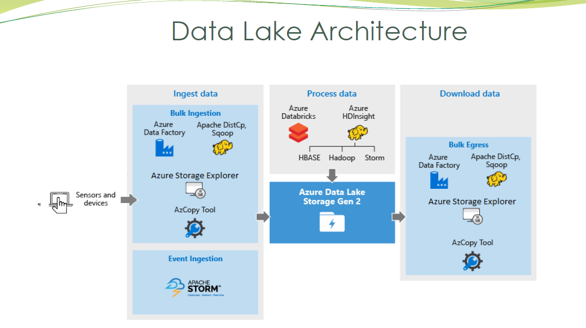
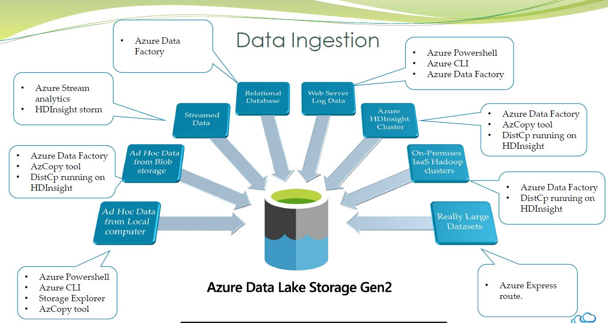
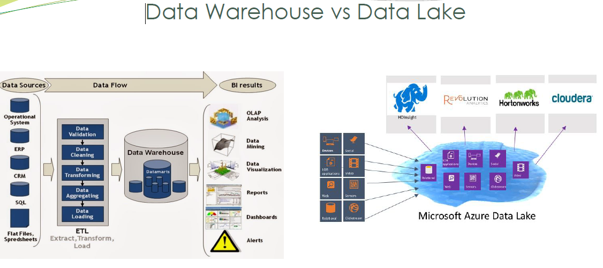

# Microsft Azure

## <b><u>Azure Data Engineering Technologies.</b></u> 

### <b><u>Azure SQL Database</b></u> 

- It is a main Database Service provided by Azure 
- Iaas- Azure Database in virtual Machine
- Azure Database and Azure Datawarehouse is different
- Deployment types
    - Single Database
    - Elastic pool
    - Managed Instance
- It is Fully Managed Service
- Predictable Performance and Pricising
- Elastic Pool Enables pool of databases to share common resources
- High Availability
- Geo-Replication and Restore Services
- Two Options
    - IaaS ( SQL Server on Virtual Machine)
    - PaaS ( DB as Service)
        - Single Database
        - Elastic Pool
        - Managed Instance.
- Azure SQL Database is nothing but SQL Server running on Cloud.

### <b><u> Azure SQL Data Warehouse </b></u>

- Azure SQL Dataware house is basically SQL Server with Setting optimized for OLAP, ( Similar to Oracle being used as OLTP and OLAP with different setting)
- OLAP Support
- It is primarily used for Querying and Reporting
- Supports MPP ( Massing Parallel Processing)
- You can pause the virtual Service to save the cost
- Azure SQL Datawarehouse in very costly
- It supports Pollybase.
- Deployment modes similar to Azure SQL Database.
- Managed Instance ? is a deployment option of Azure providing near 100% Compatibility with latest SQL Server on-prem
- Migration Option 
    - Data Migration Service
    - Back and Restore.
- Service Tiers of Managed Instances
    - General Purpose ( Standard Edition)
    - Business Critical (Enterprise Edition)

### <b><u>Azure Synapse Analytics </b></u>

- Azure Synapse Analytics is a Cloud database provided by Azure.
- Supports MPP ( Massive Parallel Processing)
- No Hardware Maintainance.
- Similar to Redshift in AWS
- Azure Dataware History
    - Generation 1 : SQL Datawarehouse (2015)
    - Generation 2 : SQL Datawarehouse (2018)
    - Generation 3 : Azure Synapse Analytics.
- Synapse is the next generation of Azure SQL Data Warehouse, blending big data analytics, data warehousing, and data integration into a single unified service that provides end to end analytics with limitless scale
- Integration :
    - It can integrate with Power BI
    - Azure Machine Learning.
- Main USP of Synapse Analytics is its price
    - 14x Faster 
    - costs 94% less that other cloud providers.
    - Comparison 
        - 33$ Azure Synapse Analytics
        - 48$ Reshift 
        - 103$ Snoflake Standard
        - 500$ Google Big Query 
- Azure Synapse 
    - Structured and Unstructured Data
    - Data Warehousing and Big data analytics
    - Cloud Support
- Features :
    - Limitless scale
    - Powerful Insight
    - Unified Experience
    - Security
    - Code free Data Generation
    - Choice of Language

### <b><u>Azure Data Lake </b></u>

- Data Lake is Big container to store the data.
- Data Lake Sources can be anything
    - Weblogs,Json,XML,csv
    - Application Data
    - Traditional Databases
    - Sensor Data, Social Media
    - Streaming Data
- <b><u>Data Lake : </b></u> If you think of a DataMart as a store of bottled water clean and packaged and structured
for easy consumption the data lake is a large body of water in a more natural state The contents of the data lake stream in from a source to fill the lake, and various users of the lake can come to examine.
- Data Lake can use : 
    - HDFS
    - Kafka
    - NoSQL
    - Kudu
- Data Lake History : 
    - Generation 1 : 
        - HDFS as a storage
        - Fault tolerant file system.
        - Map Reduce,Pig,Hive,Spark etc.
        - HDFS in cloud --> Data Lake Storage Gen 1 
    - Generation 2 :
        - Blob Storage + Data Lake Gen 1
        - Microsoft Recomments Blob Storage for Big Data workloads
        - This is Similar to what AWS Support ( EMR and under the hood S3 as storage), here we HDInsight or Azure as a Managed Cluster and Blob storage as Storage layer ( Similar to S3/HDFS)

### <b><u> Azure Blob Storage </b></u>

- Large Object Storage in cloud.
- Optimized for storage of Massive amount of unstructured data.
- General Purpose Object storage
- Cost Efficient
- Multiple Storage Tiers.
- Blob storage is not hierarchial Namespace but you can simulate tree like structure by using slash.
- Blob Storage is similar like S3 in AWS.

### <b><u>NoSQL DB </b></u>

- RDBMS was lacking 2 main things scalability and flexibility ( Schema is fixed in RDBMS)
- NoSQL : 
    - Not only SQL or No Structured Query Language
    - Horizontal Scaling Possible.
    - No Schema Enforced.
- NoSQL Use Cases : 
    - Big Data and real time web applications.
    - Relantionship between data is not important.
    - Data Change frequently.
- NoSQL Limitations : 
    - Schema less means inconsistance data.
    - Denormalized means Redundant Data.
    - Redundant means in-acuuracies and conflicts.
    - Doesnt support important features of RDBMS 
        Stored Procedured,Functions,Views,Row-level Security,Locks etc.

- 4 Types of SQL Databases;
    - Document (CosmosDB,MongoDB,DocumentDB,CouchDB)
    - Graph (CosmosDB, Neo4j)
    - Key Value (Redis,CosmosDB,Oracle Berkeley DB,)
    - wide Column (CosmosDB,Cassandra,Hbase,Vertica,Droid,Hypertable)

### <b><u>CosmosDB </b></u>

- History :
    - In 2010, Microsoft realized it needs to build global distributed database.
    - In 2015, Azure released Azure Document DB which supports SQL Queries over JSON Document.
    - In 2017, Rebranded DocumentDB as CosmosDB which is Globally Distributed and scalable database.

- Features : 
    - Fully Managed
        - Database as a service
        - serverless architecture.
        - No Operational Overhead.
        - No Schema or Index Management.
    - Globally Distributed Database.
    - Scalable : Unlimited scale for both storage and thoroughput.
    - Consistancy choice : Azure Cosmos DB's support for consistency levels like strong, eventual, consistent prefix, session,and bounded staleness.
    - MultiModel & Multi Language Support : 
        - Supports Json documents, table graph and columnar data models.
        - Java,.Net,Python,JavaScript etc.
    - Higly Reliable , Available and Secure : 
        - 99.999% SLA
        - Always on.
        - less than 10m/s latency
- Different Variants of CosmosDB
    - Cosmos DB Table API
    - Cosmos DB Cassandra API ( Similar to Cassandra)
    - Cosmos DB Gremlin API (Similar to Neo4j)
    - SQLCore API (similar to Mongo)

### <b><u>Streaming Analytics </b></u>

- Streaming Anaytics is bit like Kinesis in AWS.
- 3 Main parts  
    - Event Producer
    - Event Processor
    - Event Consumer.
- Azure Options for Live Data processing.
    - HDInsight with Spark Streaming.
    - HDInsight with Storm.
    - Apache Spark in Databricks
    - Azure Functions.
    - Web lobs
    - Azure Stream analytics

- Four types of window functions
    - Tumbling window
    - Hopping window
    - Sliding window
    - Session window

- You can run SQL Queries on top of Streaming
- Best Example can be Sql Queries for Incoming Tweets.

### <b><u>Azure Databricks </b></u>

- Apache Spark 
    - Fast and efficient.
    - In-memory Engine.
    - Highly Scalable Architecture.
    - Unifies variety of use cases.

- Databricks provides easy way to use Spark and contains most optimized Spark
- Spark from Databrick will have faster than vanilla Spark from Apache.
- Databricks : An Apache Spark based unified Analytics platform , optimized for cloud.
- Databricks provide.
    - Efficient and Interactive platform
    - Tool for differnt purpose.
    - Integrated and Interactive purpose.
    - User Interface to manage Infrastructure.

### <b><u>Azure Data Factory </b></u>

- Azure Data Factory (ADF) is a hybrid data integration service that enables you quickly and efficiently create automated data pipelines - without having to write any code.
- It provides more than 80 connectors to different services available.
- Using newly added DataFlow , Now Data factory is complete cloud based ETL Tool.
- Features
    - Hybrid Data Integration Service
    - Simplifies ETL at scale
    - Enables modern data integration
    - Drag and drop interface
    - Over 80 connectors available
    - Move, transform and save data
    - Managed Service
    - Create Data Driver workflows
    - Orchestrate and automate data movement
    - Transform and store data
    - Operationalize the process
    - ETL or ELT scenarious
- Behind the scene Data Flow will execute on Azure Databrick using Spark
- Azure Data Factory handles all the code translation, spark Optimization and execution of transformation.

### <b><u>Azure Monitoring Service </b></u>

- This is similar to Clodlogs in AWS. 
- This have features like creating dashboards , alerts etc.
- All the services of Azure have logs in Monitoring Services.
- Azure Monitor mostly consists of 2 parts : 
    - Metrics 
    - Logs.
- Metics are used in Metric Explorer
- Logs are used for Log Analytics.

### <b><u> HDInsight</b></u>

- HDInsight is similar to EMR in AWS.
- Its Managed Hadoop cluster. 
- You can Spin the cluster with required softwares within few minutes.
- HDInsight ( Microsoft + Hortonworks)
- Important aspects
    - Spark
    - Hive
    - Pig
    - Kafka
    - Apache Storm
    - It provides Ambari UI access, which is reponsible for cluster administration,monitoring and configuration.
- HDInsight Decoupled Architecture :
     

### <b><u> Important Slides. </b></u>

